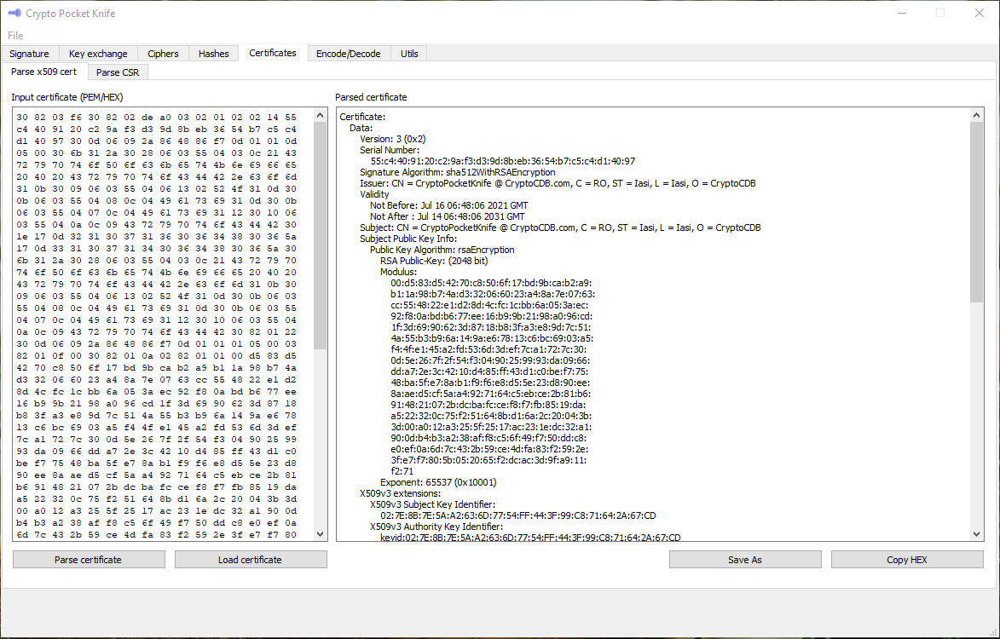

# Crypto pocket knife

Small tool for all kind of cryptographic operation used often. It currently supports the following:

1. Signatures handling
	o Public/Private keys pair generation for ED25519
	o ED25519 Signature calculation and verification

2. Key exchange
	o X25519 Public/Private keys generator
	o X25519 secret exchange
	o Symmetric keys generator after key exchange

3. Ciphers
	o AES-CTR Encryption/Decryption

4. Hashing
	o SHA512 hashing

5. Cettificates handling
	o Parse X509 certificates from any format: PEM/DER/BIN/File
	o Export X509 certificates to PEM/DER/BIN formats
	o Parse X509 CSR (certificate singing request) from any format: PEM/DER/BIN/File
	o Export X509 CSR to PEM/DER/BIN formats

6. Data encoding
	o Automatic conversion between BIN/ASCII/HEX/Base64

	
# Previews:
